# AgentCore Memory — Self-Managed Pipeline

Repositório de experimentação e validação do pipeline de memória episódica usando **Amazon Bedrock AgentCore Memory** com estratégia `SELF_MANAGED`. Todos os scripts aqui simulam componentes que, em produção, serão provisionados via IaC (CDK/Terraform) e orquestrados por Step Functions + Lambda.

> ⚠️ **Contexto importante:** O recurso `AgentCore Memory` ainda não possui suporte nativo nos providers Terraform e CDK. O script `create_memory.py` serve como substituto temporário até que esse suporte seja disponibilizado.

---

## Arquitetura




### Fluxo local simulado

1. O **`sqs_event.py`** injeta o evento SQS diretamente, simulando a entrega de 1 mensagem pela fila
2. O **`lambda_handler(event, context)`** recebe o evento e extrai o `s3PayloadLocation` e `jobId`
3. O pipeline baixa o arquivo de mensagens do **S3** (`get_object`), substituindo o trigger real do AgentCore
4. O **Step 1 — Extraction** é executado chamando diretamente `invoke_claude(EXTRACTION_SYSTEM_PROMPT)`, sem Lambda separada
5. O **Step 2 — Consolidation** é executado em sequência com `invoke_claude(CONSOLIDATION_SYSTEM_PROMPT)`, sem Step Functions orquestrando
6. O **Step 3 — Reflection** é executado com `invoke_claude(REFLECTION_SYSTEM_PROMPT)`, completando o pipeline em processo único
7. O **`save_to_agentcore()`** persiste as reflections via `batch_create_memory_records`, idêntico ao comportamento de produção
8. O **`retrieve.py`** valida o resultado chamando `retrieve_memory_records`, simulando o `GET /retrieve` do agente


### Fluxo completo cenario Produtivo

1. O **agente** envia turnos de conversa via `POST /turn` para o **API Gateway**
2. A **Lambda backend** recebe a requisição e chama `create_event` no AgentCore Memory
3. Ao acumular **10 mensagens** (trigger configurado), o AgentCore grava o payload no **S3** e notifica o **SNS**
4. O SNS repassa a notificação para o **SQS**, que serve de buffer para o processamento assíncrono
5. A **Lambda consumer** consome 1 mensagem por vez e dispara uma execução do **Step Functions**
6. O Step Functions executa o pipeline de 3 etapas: **Extraction → Consolidation → Reflection**
7. Em cada etapa, o pipeline lê o arquivo de mensagens do **S3** e invoca o **Claude via Bedrock**
8. O resultado final (reflections) é salvo de volta no **AgentCore Memory** via `batch_create_memory_records`
9. O **agente** pode recuperar contexto episódico a qualquer momento via `GET /retrieve` → **Lambda backend** → `retrieve_memory_records`

---

## Estrutura do projeto

```
agentcore-memory/
├── src/
│   ├── pipeline_lambda.py     # Pipeline principal (Extraction → Consolidation → Reflection)
│   └── sqs_event.py           # Evento de teste simulando trigger do SQS
├── create_memory.py           # Criação da Memory e Strategy no AgentCore
├── retrieve.py                # Teste de retrieve das reflections salvas
├── save.py                    # Teste isolado de salvamento de turns no AgentCore
├── agentcore_pipeline_architecture_v3.svg
└── README.md
```

---

## Descrição dos arquivos

### `create_memory.py`
**Simula:** provisionamento de infraestrutura (substituto temporário ao Terraform/CDK)

Cria o recurso `Memory` no AgentCore com a estratégia `SELF_MANAGED` configurada com:
- Trigger de **10 mensagens** acumuladas
- Trigger de **1000 tokens**
- Timeout de **10 segundos** de inatividade
- Destino de payload: **S3** + notificação via **SNS**

> Em produção este recurso será criado via IaC. Enquanto o Terraform e o CDK não suportam nativamente o `bedrock-agentcore`, este script serve como bootstrap manual.

---

### `src/pipeline_lambda.py`
**Simula:** os handlers que rodarão dentro de cada step do **Step Functions**

É o coração do pipeline. Recebe o evento SQS (com o path do arquivo S3) no cenário local, mas em produção deve receber StartExecution event do Step Function que starta processo inicial e executa as três etapas de processamento via Claude (Bedrock) e salva os resultados no AgentCore Memory.

**Etapas internas:**

| Etapa | O que faz |
|---|---|
| **Extraction** | Analisa cada turno da conversa individualmente — contexto, intenção, ação, raciocínio e outcome |
| **Consolidation** | Sintetiza a conversa como um todo — situação, objetivo, avaliação (SUCCESS/PARTIAL/FAILURE) e justificativa |
| **Reflection** | Extrai insights acionáveis e reutilizáveis para conversas futuras, com título, casos de uso, dicas práticas e score de confiança |

O resultado das reflections é persistido no AgentCore via `batch_create_memory_records`, tornando-se disponível para retrieve semântico futuro.

**Bloco de execução local:**
```python
if __name__ == "__main__":
    from sqs_event import event

    class FakeContext:
        aws_request_id = "local-test-request-id"

    result = lambda_handler(event, FakeContext())
    print(json.dumps(result, indent=2, default=str))
```

---

### `src/sqs_event.py`
**Simula:** o evento que o SQS entrega para a Lambda consumer após o AgentCore triggar o SNS

Contém o payload real capturado do SNS, incluindo `s3PayloadLocation` e `jobId` com a hierarquia `memoryId/strategyId/actorId/sessionId/timestamp`.

```python
event = {
    "Records": [{
        "Sns": {
            "Message": "{\"jobId\": \"...\", \"s3PayloadLocation\": \"s3://...\", ...}"
        }
    }]
}
```

Usado exclusivamente para testes locais do `pipeline_lambda.py`.

---

### `save.py`
**Simula:** o `POST /turn` — o envio de um turno de conversa ao AgentCore Memory

Chama `create_event` diretamente no AgentCore para ingerir mensagens de usuário e assistente. Em produção, este comportamento estará dentro da **Lambda backend** que serve o endpoint `POST /turn` do API Gateway.

Útil para popular a memória manualmente e validar se o trigger de 10 mensagens está funcionando corretamente.

---

### `retrieve.py`
**Simula:** o `GET /retrieve` — a busca semântica de reflections armazenadas

Chama `retrieve_memory_records` no AgentCore com uma `searchQuery` e um `namespace`, retornando as reflections mais relevantes para o contexto informado.

Em produção, este comportamento estará dentro da **Lambda backend** que serve o endpoint `GET /retrieve` do API Gateway. O agente usa este endpoint antes de responder ao usuário para enriquecer o contexto com aprendizados de conversas anteriores.

```python
result = agentcore_rt.retrieve_memory_records(
    memoryId=MEMORY_ID,
    namespace=f"/reflections/{ACTOR_ID}",
    searchCriteria={
        "searchQuery": "planejamento de viagem recomendações",
        "topK": 5
    }
)
```

---

## Variáveis de ambiente (produção)

| Variável | Descrição |
|---|---|
| `MEMORY_ID` | ID da Memory criada (``) |
| `STRATEGY_ID` | ID da Strategy criada (``) |
| `MODEL_ID` | Model ID do Claude no Bedrock |
| `REGION` | Região AWS (`us-east-1`) |

---

## Pré-requisitos

```bash
pip install boto3
```

Credenciais AWS configuradas com permissões para:
- `bedrock-agentcore:*`
- `bedrock:InvokeModel`
- `s3:GetObject` no bucket de payloads
- `sns:Publish` no tópico configurado

---

## Ordem de execução para testes

```bash
# 1. Criar a Memory (apenas uma vez)
python create_memory.py

# 2. Popular com turns para triggar o pipeline
python save.py

# 3. Rodar o pipeline localmente (simula Step Functions)
python src/pipeline_lambda.py

# 4. Validar o retrieve
python retrieve.py
```
